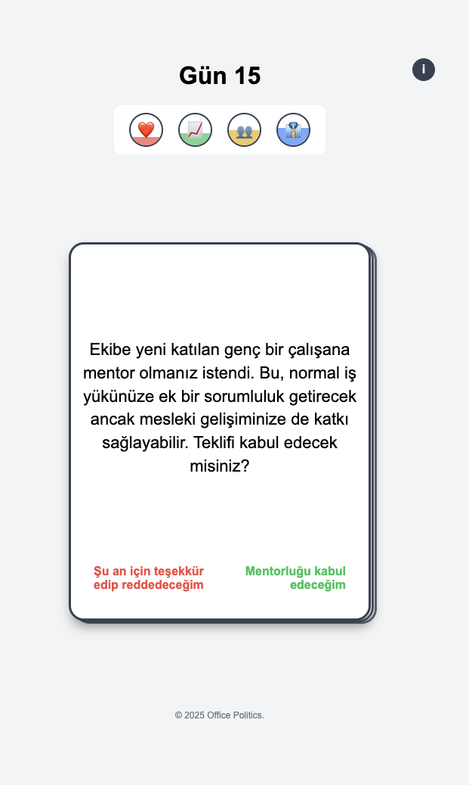
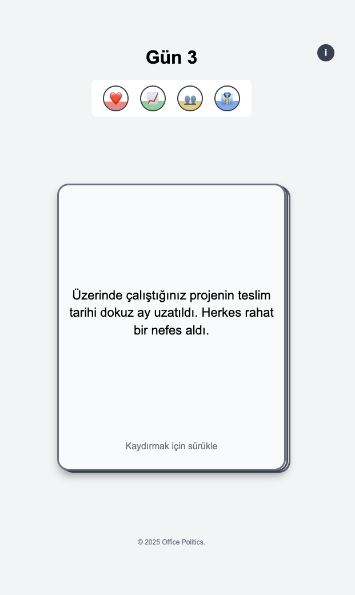

# Office Politics

A web-based card-swiping game inspired by Reigns, simulating office life decisions and politics.

[Play Now!](https://officepolitics.netlify.app/)

## Overview

Office Politics is a card-based decision game where you navigate the complex dynamics of corporate life. Balance your motivation, performance, relationships with colleagues, and your boss's opinion of you through daily decision-making. Swipe right for "yes" and left for "no" to respond to various workplace scenarios.

## Game Mechanics

- **4 Key Stats to Balance:**
  - ❤️ **Motivation** - Your mental health and enthusiasm for the job
  - 📈 **Performance** - Your productivity and efficiency at work
  - 👥 **Colleagues** - Your relationships with fellow employees
  - 👔 **Boss** - Your standing with management

- **Decision Making:** Each card presents a workplace scenario that requires your decision. Your choices affect your stats positively or negatively.

- **Game Progress:** The game tracks your progress by days. How long can you survive in the corporate world?

## Features

- Responsive design that works on desktop and mobile devices
- Simple, intuitive swipe mechanics (drag or click)
- Over 100 different office scenarios to encounter
- Turkish language support (only Turkish for now)

## Screenshots

| | |
|:-------------------------:|:-------------------------:|
|  |  |

## How to Play

1. Read the scenario presented on each card
2. Swipe right (or click the green "Evet" button) to say Yes
3. Swipe left (or click the red "Hayır" button) to say No
4. Keep an eye on your stats - if any reach 0% or 100%, you lose!
5. Try to survive as many days as possible
6. You can win the game by receiving an offer from another company, you need to keep your stats balanced to achieve this

## License

This project is licensed under the MIT License - see the [LICENSE](LICENSE) file for details.

## Acknowledgments

- Inspired by the game mechanics of [Reigns](https://reignsgame.com/)
- Special thanks to everyone who contributed scenario ideas
